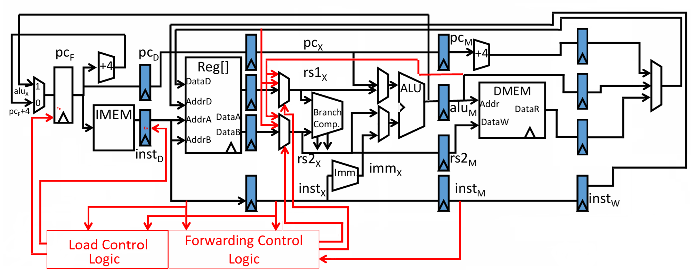

# RISC-V: From Single-Cycle to Pipelined Implementation

## Overview  
This project implements a **RISC-V processor** using a **Hardware/Software Co-Design approach**, transitioning from a **single-cycle** design to a **pipelined implementation** with hazard detection.  

### **Co-Design Aspects**
- **Hardware (HW):** A fully functional **RISC-V pipelined processor** implemented in Verilog.  
- **Software (SW):** A RISC-V assembly program written and simulated in **Venus**, generating instructions executed by the hardware.  

The processor supports multiple instruction formats, including **R-type, I-type, S-type, B-type, U-type, and J-type**.  

## Features  
- **Single-cycle and pipelined implementations**  
- **Hazard detection unit** 
- **Fully parameterized and modular design**  
- **Supports standard RISC-V instruction types**  

## RISC-V Single-Cycle

## Pipelined RISC-V

## Design Structure  

The design is organized into the following modules:  

### **Pipelined Implementation**  

#### 1. Data Path

Implements the main processing components of the pipeline.  
- [`Add.v`](Data_Path/Add.v) – Simple adder unit  
- [`ALU.v`](Data_Path/ALU.v) – Arithmetic Logic Unit for computation  
- [`BranchComp.v`](Data_Path/BranchComp.v) – Compares register values for branching  
- [`Data_Path.v`](Data_Path/Data_Path.v) – Integrates all datapath components  
- [`En_Register.v`](Data_Path/En_Register.v) – Register with enable signal  
- [`ImmGen.v`](Data_Path/ImmGen.v) – Immediate value generator  
- [`Mux2x1.v`](Data_Path/Mux2x1.v) – 2-to-1 multiplexer  
- [`Mux3x1.v`](Data_Path/Mux3v1.v) – 3-to-1 multiplexer  
- [`PC.v`](Data_Path/PC.v) – Program Counter  
- [`Register.v`](Data_Path/Register.v) – Single register module  
- [`RegisterFile.v`](Data_Path/RegisterFile.v) – Register file containing all general-purpose registers  

#### 2. Control Logic
Handles instruction decoding, execution control, memory operations, and write-back.  
- [`Control_Logic_Decode.v`](Control_Logic/Control_Logic_Decode.v) – Decodes instructions and generates control signals  
- [`Control_Logic_Execute.v`](Control_Logic/Control_Logic_Execute.v) – Controls ALU operations  
- [`Control_Logic_Memory.v`](Control_Logic/Control_Logic_Memory.v) – Manages memory read/write operations  
- [`Control_Logic_Write.v`](Control_Logic/Control_Logic_Write.v) – Handles register write-back  

#### 3. Hazard Unit 

Detects and resolves data hazards in the pipeline.  
- [`Hazard_Unit.v`](Hazard_Unit/Hazard_Unit.v) – Implements forwarding and stall logic  

#### 4. Memory
Handles instruction and data memory storage.  
- [`DMEM.v`](Memory/DMEM.v) – Data Memory module  
- [`IMEM.v`](Memory/IMEM.v) – Instruction Memory module  
- [`instruction.txt`](Memory/instruction.txt) – Sample instruction memory file  

#### **Venus Program Code** 
- [`Venus.txt`](Venus.txt) – Contains RISC-V assembly code for testing on [Venus Simulator](https://venus.cs61a.org/)  

## Simulation & Testing  
- Testbenches validate correct execution for various instruction types  
- Waveforms illustrate pipeline operation and hazard handling  
- Includes memory initialization for testing real instruction sequences  

## Running the Project  
To simulate the project, use your preferred Verilog simulator (e.g., **ModelSim, Xilinx Vivado, or QuestaSim**).

To run the project you can use [run.do](run.do)
